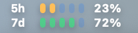
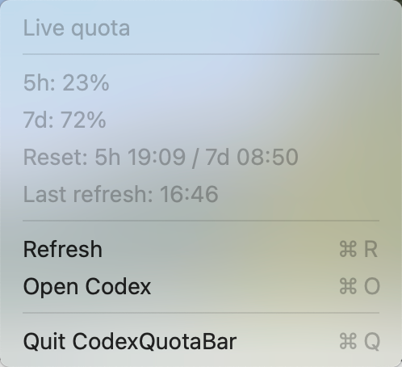

# CodexQuotaBar

CodexQuotaBar is a small macOS menu bar app for showing local Codex quota at a glance.

## Goal

Show Codex 5-hour and 7-day quota directly in the macOS status bar with a compact visual style:

```text
5h  ooo--  52%
7d  oo---  42%
```

The app is lightweight, local-first, and easy to inspect.

See [REQUIREMENTS.md](REQUIREMENTS.md) for the current product requirements and safety boundaries.

## Actual Preview

Menu bar display:



Dropdown menu:



Floating ball:

<table>
  <tr>
    <td align="center"></td>
    <td align="center"></td>
  </tr>
  <tr>
    <td align="center">Healthy</td>
    <td align="center">Mixed</td>
  </tr>
</table>

## Current Scope

- Show 5-hour quota percentage in the menu bar.
- Show 7-day quota percentage in the menu bar.
- Use five small signal dots/bars for each quota row.
- Color status by remaining quota:
  - Green: greater than 60%
  - Orange: 20% to 60%
  - Red: less than 20%
- Refresh automatically every 5 minutes.
- Show a small floating ball by default.
- Remember floating ball visibility and position.
- Provide a menu with:
  - Last refresh time
  - 5-hour reset time
  - 7-day reset time
  - Manual refresh
  - Optional floating ball
  - Open at Login toggle
  - Open Codex
  - Quit

## Install From GitHub Releases

Download the latest `CodexQuotaBar-*.dmg` from GitHub Releases.

1. Open the DMG.
2. Drag `CodexQuotaBar.app` into `Applications`.
3. Open `CodexQuotaBar` from Applications.
4. If macOS blocks the app, open System Settings > Privacy & Security and allow it.

Requirements:

- macOS 13 or newer.
- Codex desktop app or Codex CLI installed and signed in.

Uninstall:

1. Quit CodexQuotaBar from the menu bar.
2. Delete `/Applications/CodexQuotaBar.app`.
3. Optional clean removal: delete `~/Library/Application Support/CodexQuotaBar/preferences.json`.

The release is ad-hoc signed and not notarized. It does not install a LaunchAgent, daemon, or auto-updater. Open at Login is optional and controlled from the app menu.

## Versioning

- `v0.1.0` is the first public test release.
- `v0.2.0` adds the floating ball, saved UI preferences, startup retry, and Open at Login.

## Safety Boundaries

- Do not read browser cookies.
- Do not read `~/.codex/auth.json`.
- Do not scan unrelated project folders.
- Do not store prompts or responses.
- Store only UI preferences in `~/Library/Application Support/CodexQuotaBar/preferences.json`.
- Do not install a LaunchAgent.
- Do not add auto-update.
- Do not use batch-delete commands such as `rm -rf`.

## Run Locally

Build the local app bundle:

```bash
./script/build.sh
```

Run the menu bar app:

```bash
./script/run.sh
```

The app bundle is created at:

```text
native/build/CodexQuotaBar.app
```

This local build is not installed into `/Applications` and does not add a LaunchAgent, daemon, or auto-updater.

Package a release build:

```bash
./script/package_release.sh
```

Release artifacts are written to:

```text
release/
```

## Proposed Tech Stack

- Swift + AppKit for the macOS status bar app.
- Python helper for reading local Codex quota from the local Codex app-server.
- Shell scripts only for simple build commands.

## Reference Style

The target visual direction is a compact blue status bar block:

```text
5h  [5 quota bars]  52%
7d  [5 quota bars]  42%
```

Keep the display simple and readable. Do not add a right-side Codex icon; the reference image included the native Codex icon by accident. Each row should keep 5 equal-height bars, with each bar representing about 20%. Keep the bars close to the percentage text so the quota relationship is easy to read.

Avoid adding hardware metrics, themes, update systems, logs, or background persistence until the basic quota display is stable.
