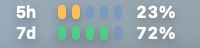
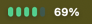

# CodexQuotaBar

CodexQuotaBar is a small macOS menu bar app for showing local Codex quota at a glance.

The project maintains two lightweight variants:

- `main`: the formal 5h + 7d quota version.
- `temp/no-5h-limit-hover`: the 7d-only quota version.

This README labels the two branches explicitly. The 7d-only variant is a parallel temporary line, not a replacement claim for `main`.

## Goal

Show the quota form that matches the checked-out branch directly in the macOS status bar with a compact visual style:

```text
main  5h  ooo--  52%
      7d  oo---  42%
temp  7d  oo---  42%
```

The app is lightweight, local-first, and easy to inspect.

See [REQUIREMENTS.md](REQUIREMENTS.md) for the current product requirements and safety boundaries.

See [CHANGELOG.md](CHANGELOG.md) for release notes.

## Maintained Variants

The two branches and their status bar behavior are shown side by side:

<table>
  <tr>
    <th>Formal 5h + 7d</th>
    <th>7d-only</th>
  </tr>
  <tr>
    <td><code>main</code></td>
    <td><code>temp/no-5h-limit-hover</code></td>
  </tr>
  <tr>
    <td align="center"></td>
    <td align="center"></td>
  </tr>
</table>

## 7d-only Preview

The remaining scope describes the lightweight `temp/no-5h-limit-hover` variant.

Menu bar display:


Floating ball:

<table>
  <tr>
    <td align="center"></td>
    <td align="center"></td>
  </tr>
  <tr>
    <td align="center">Healthy</td>
    <td align="center">Mixed</td>
  </tr>
</table>

## Current Scope

The checked-out temporary variant keeps one 7-day quota display; `main` retains the formal 5h + 7d display.

- Show 7-day quota percentage in the menu bar.
- Use five small signal bars for the quota display.
- Color status by remaining quota:
  - Green: greater than 60%
  - Orange: 20% to 60%
  - Red: less than 20%
- Refresh automatically every 5 minutes.
- Show a small floating ball by default.
- Remember floating ball visibility and position.
- Record local quota history for trend estimates.
- Provide a menu with:
  - Last refresh time
  - 7-day reset time
  - Recent quota usage trend estimate
  - Manual refresh
  - Optional floating ball
  - Open at Login toggle
  - Open ChatGPT
  - Clear Local Data
  - Quit

## Install From GitHub Releases

Download the latest `CodexQuotaBar-*.dmg` from GitHub Releases.

1. Open the DMG.
2. Drag `CodexQuotaBar.app` into `Applications`.
3. Open `CodexQuotaBar` from Applications.
4. If macOS blocks the app, open System Settings > Privacy & Security and allow it.

Requirements:

- macOS 13 or newer.
- ChatGPT desktop app, legacy Codex desktop app, or Codex CLI installed and signed in.

Uninstall:

1. Quit CodexQuotaBar from the menu bar.
2. Delete `/Applications/CodexQuotaBar.app`.
3. Optional clean removal: use `Clear Local Data...` from the app menu before deleting the app,
   or delete `~/Library/Application Support/CodexQuotaBar`.

The release is ad-hoc signed and not notarized. It does not install a LaunchAgent, daemon, or auto-updater. Open at Login is optional and controlled from the app menu.

## Versioning

- `v0.1.0` is the first public test release.
- `v0.2.0` adds the floating ball, saved UI preferences, startup retry, and Open at Login.
- `v0.2.1` restores quota access after the Codex desktop app moved into ChatGPT.
- `v0.3.0` adds local quota history, usage trend estimates, and local data cleanup.
- `main` remains the formal 5h + 7d line.
- `temp/no-5h-limit-hover` remains the 7d-only temporary line.

## Safety Boundaries

- Do not read browser cookies.
- Do not read `~/.codex/auth.json`.
- Do not scan unrelated project folders.
- Do not store prompts or responses.
- The Codex CLI may maintain its own runtime state under `~/.codex`.
- Store UI preferences and quota history in `~/Library/Application Support/CodexQuotaBar`.
- Quota history is stored in `history.sqlite` and contains only timestamps, remaining quota percentages, reset times, plan, and source.
- Keep quota history local and prune it to the recent retention window.
- Do not install a LaunchAgent.
- Do not add auto-update.
- Do not use batch-delete commands such as `rm -rf`.

## Run Locally

Build the local app bundle:

```bash
./script/build.sh
```

Run the menu bar app:

```bash
./script/run.sh
```

The app bundle is created at:

```text
native/build/CodexQuotaBar.app
```

This local build is not installed into `/Applications` and does not add a LaunchAgent, daemon, or auto-updater.

Package a release build:

```bash
./script/package_release.sh
```

Release artifacts are written to:

```text
release/
```

## Proposed Tech Stack

- Swift + AppKit for the macOS status bar app.
- Python helper for reading local Codex quota from the local Codex app-server.
- Shell scripts only for simple build commands.

## Reference Style

The target visual direction is a compact blue status bar block. The temporary branch uses:

```text
7d  [5 quota bars]  72%
```

Keep the display simple and readable. Do not add a right-side Codex icon; the reference image included the native Codex icon by accident. Keep 5 equal-height bars, with each bar representing about 20%, close to the percentage text.

Avoid adding hardware metrics, themes, update systems, logs, or background persistence until the basic quota display is stable.
