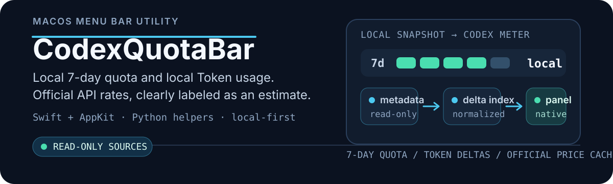
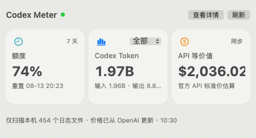
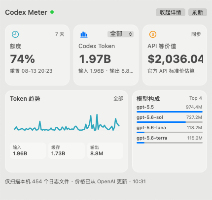

# CodexQuotaBar

CodexQuotaBar is a small, local-first macOS menu bar app for showing Codex 7-day quota, local token usage, and estimated API-equivalent value at a glance.

## Goal

Keep one readable 7-day quota indicator in the macOS status bar. Click it to open a compact native `NSPanel`, then expand that same panel vertically for detailed statistics.

The app is lightweight, local-first, and easy to inspect.

See [REQUIREMENTS.md](REQUIREMENTS.md) for the current product requirements and safety boundaries.

See [CHANGELOG.md](CHANGELOG.md) for release notes.

## Actual Preview

<p align="center">
  
</p>

Compact cockpit:



Expanded cockpit:



Status bar:


Floating ball:

<table>
  <tr>
    <td align="center"></td>
    <td align="center"></td>
  </tr>
  <tr>
    <td align="center">Healthy</td>
    <td align="center">Mixed</td>
  </tr>
</table>

## Current Scope

- Show one 7-day quota percentage in the menu bar.
- Use five small signal bars and a readable percentage.
- Color status by remaining quota:
  - Green: greater than 60%
  - Orange: 20% to 60%
  - Red: less than 20%
- Refresh automatically every 5 minutes.
- Show a small floating ball by default.
- Remember floating ball visibility and position.
- Open a compact three-card cockpit for quota, Codex Token, and API-equivalent value.
- Keep the quota card fixed to the current 7-day window; API-equivalent value follows the selected Token period.
- Expand the same panel vertically for a compact trend and model summary without enlarging the cards.
- Show token trend and model composition without adding project or conversation analytics.
- Refresh local quota and token data every five minutes.
- Refresh official OpenAI prices only at launch or manual refresh, with local fallback.
- Keep the optional floating ball, manual refresh, Open at Login, Open ChatGPT, local-data cleanup, and Quit controls.

## Install From GitHub Releases

Download the latest `CodexQuotaBar-*.dmg` from GitHub Releases.

1. Open the DMG.
2. Drag `CodexQuotaBar.app` into `Applications`.
3. Open `CodexQuotaBar` from Applications.
4. If macOS blocks the app, open System Settings > Privacy & Security and allow it.

Requirements:

- macOS 13 or newer.
- ChatGPT desktop app, legacy Codex desktop app, or Codex CLI installed and signed in.

Uninstall:

1. Quit CodexQuotaBar from the menu bar.
2. Delete `/Applications/CodexQuotaBar.app`.
3. Optional clean removal: use `Clear Local Data...` from the app menu before deleting the app,
   or delete `~/Library/Application Support/CodexQuotaBar`.

The release is ad-hoc signed and not notarized. It does not install a LaunchAgent, daemon, or auto-updater. Open at Login is optional and controlled from the app menu.

## Versioning

- `v0.1.0` is the first public test release.
- `v0.2.0` adds the floating ball, saved UI preferences, startup retry, and Open at Login.
- `v0.2.1` restores quota access after the Codex desktop app moved into ChatGPT.
- `v0.3.0` adds local quota history, usage trend estimates, and local data cleanup.
- `v0.3.1-temp` is a temporary branch build for the current single-quota Codex limit shape.
- `v0.4.0-temp` adds the real-data quota cockpit, token history, and official API-equivalent estimates.

## Safety Boundaries

- Do not read browser cookies.
- Do not read `~/.codex/auth.json`.
- Scan only Codex session metadata under `~/.codex/sessions`, `~/.codex/archived_sessions`, and thread model metadata in `state_5.sqlite`.
- Do not store prompts, responses, tool arguments, or raw JSONL copies.
- Store only app preferences, quota history, normalized token deltas, file signatures, and the price cache in `~/Library/Application Support/CodexQuotaBar`.
- Unknown models remain visible as Token but are excluded from the USD estimate.
- `Clear Local Data` moves the app-owned support directory to Trash; original `~/.codex` data is untouched and can rebuild the dashboard.
- Do not install a LaunchAgent.
- Do not add auto-update.
- Do not use batch-delete commands such as `rm -rf`.

## Run Locally

Build the local app bundle:

```bash
./script/build.sh
```

Run the menu bar app:

```bash
./script/run.sh
```

For local visual QA, launch the real panel directly with `--preview` or its expanded state with `--preview-detail`.

The app bundle is created at:

```text
native/build/CodexQuotaBar.app
```

This local build is not installed into `/Applications` and does not add a LaunchAgent, daemon, or auto-updater.

Package a release build:

```bash
./script/package_release.sh
```

Release artifacts are written to:

```text
release/
```

## Proposed Tech Stack

- Swift + AppKit for the macOS status bar app.
- Python helpers for reading local Codex quota, structural Token metadata, and official model price pages.
- Shell scripts only for simple build commands.

## Reference Style

The target visual direction is a compact blue status bar block:

```text
7d  [5 quota bars]  42%
```

Keep the display simple and readable. Do not add a right-side Codex icon; the reference image included the native Codex icon by accident. Keep 5 equal-height bars, with each bar representing about 20%, close to the percentage text.

Avoid adding hardware metrics, dense analytics, themes, update systems, logs, or background persistence.
